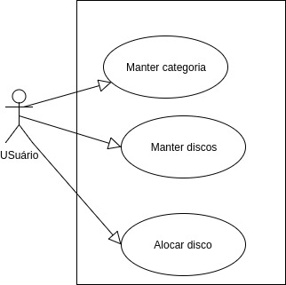
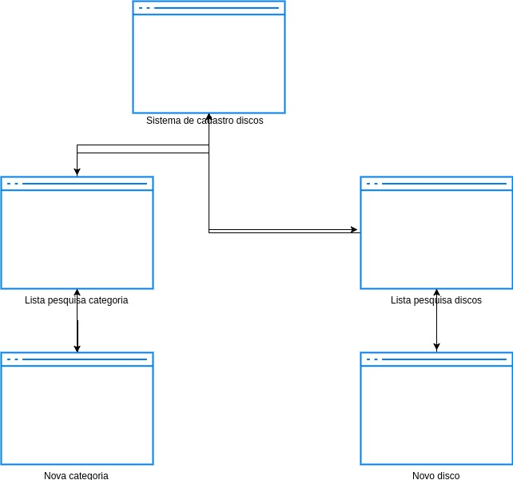

# Analise de Ponto de Função

## Definição
Quantificar o produto do trabalho de desenvolvimento e manutenção de sistemas no que diz respeito de funções efetivamente entregue aos usuários final, indepente da metodologia e ferramenta utilizada.

### Cronologia

* 1974 GUIDE IBM
* 1979 IMB - Allan Albrecht
* 1986 IFPUG
    * SPQR/20
* 1993 Function Point Workbench

## Então o que é?

Define uma medida utilizada para determinar o tamanho de uma aplicação. Ela se baseia nas funções executadas pela aplicação do ponto de vista do usuário.

#### PREMISSAS:
* Entradas Externas
* Saídas Externas
* Arquivos Lógicos Internos
* Arquivos de interface Externa
* Consulta Externa

##### Entrada Externa:
Processo elementar que processa dados ou informações de controle vindos de fora da fronteira da aplicação.
_Ex: Formulário de cadastros_
A principal intenção de uma **EE** é manter um ou mais **ALI** e/ou alterar o comportamento do sistema.

Criação de Entradas externas vai requerer várias consultas externas (Possivelmente)
* Entrada Externa para recuperar dados do cliente.
* Entrada externa para recuperar lista de produto.

##### Saída Externa:
Processo elementar que gerar dados ou informações de controle que saem da fronteira da aplicação

Principal objetivo de uma **SE** é apresentar dados ao usuário por meio de lógica de processamento que não seja apenas recuperação de dados.

A lógica de processamento deve obrigatoriamente conter ao menos uma fórmula matemática ou cálculo, ou criar dados derivados. Pode também menter um ou mais **ALI's** e/ou alterar o comportamento do sistema.

##### Exemplos:
* Relatórios com totalização de dados.
* Relatório que também atualizam arquivos.
* Consultar com apresentação de dados derivados ou cálculos.
* Geração de arquivos de movimento para outra aplicação.
* Informações em formatos gráficos.
#####  Não Exemplos:
* Consultas e relatórios sem nenhum totalizador, que não atualiza **ALI**, não tem dado derivado ou modificam o comportamento do sistema.
* Dois relatórios iguais, apenas com distinção de ordenação.

##### Arquivos lógicos interno:
Grupos lógicos de dados do ponto de vista do usuário cuja manutenção é feita internamente na aplicação.

##### Arquivos lógicos interno:
Grupos lógicos de dados que passa de uma aplicação para outra cuja manutenção pertence a outra aplicação.

##### Consultas externas:
Processo elementar que envia dados ou informações para fora da fronteira da aplicação.

A principal de uma **CE** é apresentar informação ao usuário por meio de uma simples recuperação de dados de **ALI's** e/ou **AIE's**. 

Lógica de processamento não deve conter fórmula matemática ou cálculo, criar dados derivados, manter um ou mais **ALI** e/ou alterar o comportamento do sistema.

### APF - PROCESSO
* Identificar e enumerar as funções da aplicação:
    * Número de entradas externas, Saídas Externas, Arquivos lógicos internos, Arquivos lógicos de interface e Consultas externas.
* Classificar cada uma das funções identificadas ao seu nível de complexidade
    * Simples, Médio ou complexo.
* Ajustar o número de pontos de funções brutos ao nível de complexidade do processamento.

### APF - TABELAS
#### Complexidade Entrada Externa EE

 Campos | 1 à 4 itens de dados referenciados | 5 à 15 itens de dados referenciados | 16 ou mais itens de dados referenciados 
---- | ---- | ---- |----
0  ou 1 tipo de arquivo referenciado | simples | simples | médio
2 tipos de arquivos referenciados | simples | médio | Complexo 
3 ou mais tipos de arquivos referenciados | Médio | Complexo | Complexo.


#### Complexidade Saída Externa SE

 Campos | 1 à 5 itens de dados referenciados | 6 à 19 itens de dados referenciados | 20 ou mais itens de dados referenciados 
---- | ---- | ---- |----
0  ou 1 tipo de arquivo referenciado | simples | simples | médio
2 ou 3 tipos de arquivos referenciados | simples | médio | Complexo 
4 ou mais tipos de arquivos referenciados | Médio | Complexo | Complexo

#### Complexidade Arquivo Lógico Interno ALI

 Campos | 1 à 19 itens de dados referenciados | 20 à 50 itens de dados referenciados | 51 ou mais itens de dados referenciados 
---- | ---- | ---- |----
1 tipo de registro  lógico | simples | simples | médio
2 à 5 tipos de registro  lógico | simples | médio | Complexo 
6 ou mais tipos de registro  lógico | Médio | Complexo | Complexo

#### Complexidade Arquivo Lógico Externo AIE

 Campos | 1 à 19 itens de dados referenciados | 20 à 50 itens de dados referenciados | 51 ou mais itens de dados referenciados 
---- | ---- | ---- |----
1 tipo de registro  lógico | simples | simples | médio
2 à 5 tipos de registro  lógico | simples | médio | Complexo 
6 ou mais tipos de registro  lógico | Médio | Complexo | Complexo

#### Complexidade Consulta Externo CE

 Campos | 1 à 5 itens de dados referenciados | 6 à 19 itens de dados referenciados | 20 ou mais itens de dados referenciados 
---- | ---- | ---- |----
0 ou 1 tipo de arquivo referenciado | simples | simples | médio
2 ou 3 tipos de arquivo referenciado | simples | médio | Complexo 
4 ou mais tipos de registro  lógico | Médio | Complexo | Complexo

Função | Nº de ocorrencia | Complexidade | Peso | Resultado
------ | ---------------- | ------------ | ---- | ---------
**Entrada externa** | | Simples | x 3 = |
| | | Médio | x 4 =  |
| | | Complexo | x 6 =  |
| | | Total 1 |  =  |
| | | | |
**Saida externa** | | Simples | x 4 = |
| | | Médio | x 5 = |
| | | Complexo | x 7 = |
| | | Total 2 |  =  |
| | | | |
**Arquivo Lógico Interno** | | Simples | x 7 = |
| | | Médio | x 10 = |
| | | Complexo | x 15 = |
| | | Total 3 |  =  |
| | | | |
**Arquivo interface Externo** | | Simples | x 5 = |
| | | Médio | x 7 = |
| | | Complexo | x 10 = |
| | | Total 4 |  =  |
| | | | |
**Consultas** | | Simples | x 3 = |
| | | Médio | x 4 = |
| | | Complexo | x 6 = |
| | | Total 5 |  =  |

### APF - Produtividade / Linguagem

### APF - Ajustes
Para determinar o fator de ajuste, deves-se estimar o nível de influência para cada uma das características da aplicação relacinada abaixo:

1. Comumunicação de dados
2. Funções Distribuidas
3. Desempenho
4. Carga de configuração
5. Volume de transação
6. Entrada de dados online
7. Eficiência do usuário final
8. Atualização online
9. Processameneto complexo
10. Reutilização
11. Facilidade de implantação
12. Facilidade operacional
13. Múltiplos locais
14. Facildiade de mudança

0 = Não existe nenhuma influência  
1 = Pouca Influencia  
2 = Influência moderada  
3 = Influência média  
4 = Influência significativa  
5 = Grande influência  

### APF - Fator de Ajustes

```js
    
    // let NI // Nível de influencia
   // let fa  // fator de Ajuste
   // pfa // Ponde de função ajustado

   let fa =  0,65 + (0,01 * NI)
   let pfa = pfb * fa
```

# Exercitar
## Análise

RF | Levantamento de requisitos
-- | --------------------------
RF1 | O sistema deve permitir ao usuário manter categorias musicas. (Deve manter descrição da categorias)
RF2 | O Sistema deve permitir ao usuário manter discos. (Deve ser mantido o titulo do disco, ano de gravação e numero de faixas)
RF3 | O sistema deve permitir ao usuário alocar discos à categorias. (Um disco deve está alocado em uma categoria e uma categoria pode conter zero ou vários 'N' discos).


#### Diagrama de caso de uso


#### Diagrama de classe


#### Navegabildiade



#### Detalhes protótipo


EE

* Incluir Categoria - simples
* Editar Categoria - simples
* Excluir Categoria - simples
* Incluir Disco - Simples
* Editar Disco - simples
* Excluir Disco - simples 

6 x simples peso 3  = 18
0 x Médio peso 4 = 0
0 x Complexo peso 6 = 0
TOTAL: 18

SE
0 x simples peso 4  = 0
0 x Médio peso 5 = 0
0 x Complexo peso 7 = 0
TOTAL: 0

ALI

2 x simples peso 7 = 14
0 x Médio peso 10 = 0
0 x Complexo peso 15 = 0
TOTAL:  14

AIE

0 x simples peso 7 = 0
0 x Médio peso 10 = 0
0 x Complexo peso 15 = 0
TOTAL: 0

CE
* Pesquisar categoria - simples
* Pesquisar disco - simples
* ComboBox EditarDisco - simples
* load dados Editar categoria - simples
* load dados Editar disco - simples

5 x simples peso 3 = 15
0 x Médio peso 4 = 0
0 x Complexo peso 6 = 0
TOTAL : 15

### Contando


Função | Nº de ocorrencia | Complexidade | Peso | Resultado
------ | ---------------- | ------------ | ---- | ---------
**Entrada externa** | | Simples | x 3 = |
| | | Médio | x 4 =  |
| | | Complexo | x 6 =  |
| | | Total 1 |  =  |
| | | | |
**Saida externa** | | Simples | x 4 = |
| | | Médio | x 5 = |
| | | Complexo | x 7 = |
| | | Total 2 |  =  |
| | | | |
**Arquivo Lógico Interno** | | Simples | **2** x 7 = | **14**
| | | Médio | **0** x 10 = | 0
| | | Complexo | **0** x 15 = | 0
| | | Total 3 |  =  | **14**
| | | | |
**Arquivo interface Externo** | | Simples | 0 x 5 = | 0
| | | Médio | 0 x 7 = | 0
| | | Complexo | 0 x 10 = | 0
| | | Total 4 |  =  | 0
| | | | |
**Consultas** | | Simples | x 3 = |
| | | Médio | x 4 = |
| | | Complexo | x 6 = |
| | | Total 5 |  =  |

```js
//TOTAL PONTO FUNÇÃO BRUTOS 15+14+18
var pfb = 15+14+18
```